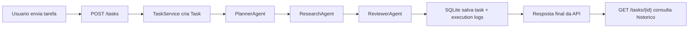
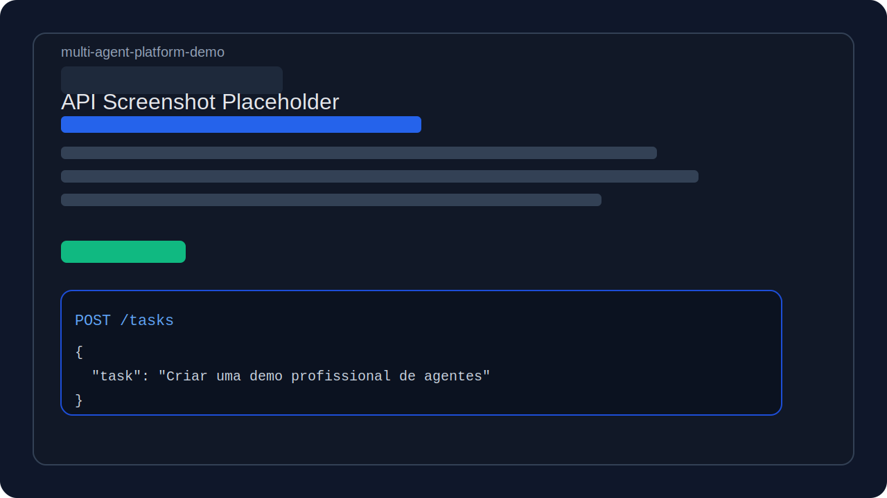
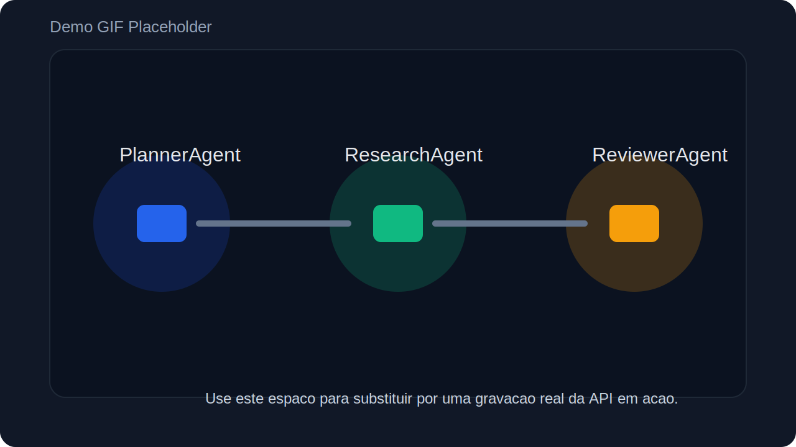

# multi-agent-platform-demo

Projeto publico em FastAPI para demonstrar, de forma simples e didatica, como uma aplicacao pode orquestrar multiplos agentes de IA sem depender de um LLM real por padrao.

## O que o projeto faz

O `multi-agent-platform-demo` recebe uma tarefa via API, executa um fluxo com tres agentes especializados, registra cada etapa da execucao e persiste o resultado em SQLite.

Principais pontos:

- `POST /tasks` cria e processa uma tarefa
- `GET /tasks/{id}` recupera o historico completo
- Cada agente registra entrada, saida, status e ordem de execucao
- O design permite adicionar novos agentes com baixo acoplamento

## O que sao agentes

Neste projeto, um agente e um componente com responsabilidade clara dentro de um fluxo maior.

- `PlannerAgent`: transforma a solicitacao do usuario em passos acionaveis
- `ResearchAgent`: gera achados simulados para cada passo do plano
- `ReviewerAgent`: revisa o material produzido e monta a resposta final

Essa separacao ajuda a demonstrar modularidade, rastreabilidade e extensibilidade, que sao temas importantes em plataformas de IA orientadas a agentes.

## Fluxo dos agentes



## Arquitetura

```text
app/
|- agents/        # Interface base e agentes concretos
|- api/           # Endpoints FastAPI
|- services/      # Orquestracao e regras da aplicacao
|- db.py          # Engine, sessao e bootstrap do banco
|- models.py      # Modelos SQLAlchemy
|- schemas.py     # Contratos Pydantic
|- main.py        # Entrada da aplicacao
```

## Tecnologias usadas

- Python 3.12
- FastAPI
- SQLite
- SQLAlchemy 2.x
- Pydantic 2.x
- Pytest
- Docker
- GitHub Actions

## Como instalar e rodar

### Rodando localmente

```bash
python -m venv .venv
. .venv/bin/activate
pip install --upgrade pip
pip install ".[dev]"
uvicorn app.main:app --reload
```

No Windows PowerShell:

```powershell
python -m venv .venv
.venv\Scripts\Activate.ps1
pip install --upgrade pip
pip install ".[dev]"
uvicorn app.main:app --reload
```

API disponivel em:

- `http://127.0.0.1:8000`
- `http://127.0.0.1:8000/docs`

### Rodando com Docker

```bash
docker compose up --build
```

## Exemplos via curl

### Criar tarefa

```bash
curl -X POST "http://127.0.0.1:8000/tasks" \
  -H "Content-Type: application/json" \
  -d '{
    "task": "Criar um plano para lancar uma landing page de produto com foco em conversao"
  }'
```

### Consultar tarefa

```bash
curl "http://127.0.0.1:8000/tasks/<TASK_ID>"
```

### Exemplo de resposta

```json
{
  "id": "8a0c55dd-4f44-4585-95f8-5fd27c8d3761",
  "task": "Criar um plano para lancar uma landing page de produto com foco em conversao",
  "status": "completed",
  "final_response": "Resumo final...",
  "executions": [
    {
      "sequence": 1,
      "agent_name": "PlannerAgent",
      "status": "completed"
    },
    {
      "sequence": 2,
      "agent_name": "ResearchAgent",
      "status": "completed"
    },
    {
      "sequence": 3,
      "agent_name": "ReviewerAgent",
      "status": "completed"
    }
  ]
}
```

## Screenshots / GIF

Placeholder de screenshot:



Placeholder de GIF:



## Deploy

Placeholder de deploy:

- [https://your-demo-url.example.com](https://your-demo-url.example.com)

## Desafios enfrentados e solucoes

### 1. Demonstrar agentes sem acoplar o projeto a um provedor real

Solucao:
Criamos agentes deterministas com saidas simuladas. Assim o repositorio continua leve, facil de testar e pronto para receber uma integracao real no futuro.

### 2. Manter o codigo simples sem perder extensibilidade

Solucao:
Foi criada uma interface base (`BaseAgent`) e um orquestrador separado da camada HTTP. Isso facilita adicionar novos agentes sem reescrever os endpoints.

### 3. Registrar observabilidade do fluxo

Solucao:
Cada etapa persiste `input_payload`, `output_payload`, timestamps, status e ordem de execucao, o que torna o comportamento auditavel.

## Melhorias futuras

- Adicionar execucao assincrona com fila
- Integrar LLM real via provider configuravel
- Expor streaming de eventos do fluxo
- Adicionar autenticacao e controle de usuarios
- Criar dashboard web para visualizar historico das tarefas
- Publicar deploy real em Railway, Render ou Fly.io

## Autor

Gabriel Quintino

- LinkedIn: [https://www.linkedin.com/in/seu-linkedin](https://www.linkedin.com/in/seu-linkedin)
- Email: [gabriel.quintino@exemplo.com](mailto:gabriel.quintino@exemplo.com)
