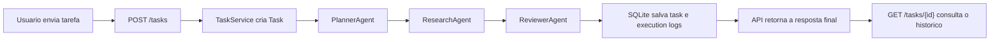

# multi-agent-platform-demo

[Read in English](README.md)

Projeto publico em FastAPI para demonstrar, de forma simples e didatica, uma orquestracao de multiplos agentes de IA. A aplicacao recebe uma tarefa, executa tres agentes especializados, registra todo o fluxo e salva tarefas e execucoes em SQLite.

## Exemplo principal da API

Este e o fluxo principal para destacar no portfolio.

### `POST /tasks`

```bash
curl -X 'POST' \
  'http://localhost:8000/tasks' \
  -H 'accept: application/json' \
  -H 'Content-Type: application/json' \
  -d '{
  "task": "Criar um plano para lancar uma landing page de produto com foco em conversao"
}'
```

### Resposta de exemplo

`id`, timestamps e detalhes internos dos payloads podem variar a cada execucao.

```json
{
  "id": "992f14b8-2ab4-40a4-a191-2847ee23a74d",
  "task": "Criar um plano para lancar uma landing page de produto com foco em conversao",
  "status": "completed",
  "final_response": "Resumo final da orquestracao:\n- Tarefa original: Criar um plano para lancar uma landing page de produto com foco em conversao\n- Plano sugerido:\n  - Entender o resultado esperado pelo usuario\n  - Organizar subetapas relacionadas a criar, plano, lancar\n  - Definir uma sequencia curta para execucao e validacao\n- Achados simulados:\n  - Insight 1: o passo 'Entender o resultado esperado pelo usuario' tende a ganhar qualidade quando possui criterio de sucesso explicito e contexto minimo.\n  - Insight 2: o passo 'Organizar subetapas relacionadas a criar, plano, lancar' tende a ganhar qualidade quando possui criterio de sucesso explicito e contexto minimo.\n  - Insight 3: o passo 'Definir uma sequencia curta para execucao e validacao' tende a ganhar qualidade quando possui criterio de sucesso explicito e contexto minimo.\n- Conclusao: o fluxo gerou uma resposta auditavel, modular e pronta para evoluir.\n- Observacao: esta demonstracao usa agentes simulados, sem integracao com LLM real.",
  "created_at": "2026-07-02T19:08:03.406127",
  "updated_at": "2026-07-02T19:08:03.422875",
  "executions": [
    {
      "id": 1,
      "sequence": 1,
      "agent_name": "PlannerAgent",
      "status": "completed",
      "input_payload": {
        "task": "Criar um plano para lancar uma landing page de produto com foco em conversao",
        "artifacts": {}
      },
      "output_payload": {
        "summary": "Task decomposed into a concise execution plan.",
        "data": {
          "focus_terms": [
            "criar",
            "plano",
            "lancar"
          ],
          "steps": [
            "Entender o resultado esperado pelo usuario",
            "Organizar subetapas relacionadas a criar, plano, lancar",
            "Definir uma sequencia curta para execucao e validacao"
          ]
        }
      },
      "started_at": "2026-07-02T19:08:03.419636",
      "completed_at": "2026-07-02T19:08:03.419807"
    },
    {
      "id": 2,
      "sequence": 2,
      "agent_name": "ResearchAgent",
      "status": "completed",
      "input_payload": {
        "task": "Criar um plano para lancar uma landing page de produto com foco em conversao",
        "artifacts": {
          "plan": {
            "focus_terms": [
              "criar",
              "plano",
              "lancar"
            ],
            "steps": [
              "Entender o resultado esperado pelo usuario",
              "Organizar subetapas relacionadas a criar, plano, lancar",
              "Definir uma sequencia curta para execucao e validacao"
            ]
          }
        }
      },
      "output_payload": {
        "summary": "Simulated research findings generated for each planning step.",
        "data": {
          "findings": [
            {
              "topic": "Entender o resultado esperado pelo usuario",
              "source_type": "simulated_internal_brief",
              "insight": "Insight 1: o passo 'Entender o resultado esperado pelo usuario' tende a ganhar qualidade quando possui criterio de sucesso explicito e contexto minimo.",
              "confidence": 0.78
            },
            {
              "topic": "Organizar subetapas relacionadas a criar, plano, lancar",
              "source_type": "simulated_internal_brief",
              "insight": "Insight 2: o passo 'Organizar subetapas relacionadas a criar, plano, lancar' tende a ganhar qualidade quando possui criterio de sucesso explicito e contexto minimo.",
              "confidence": 0.84
            },
            {
              "topic": "Definir uma sequencia curta para execucao e validacao",
              "source_type": "simulated_internal_brief",
              "insight": "Insight 3: o passo 'Definir uma sequencia curta para execucao e validacao' tende a ganhar qualidade quando possui criterio de sucesso explicito e contexto minimo.",
              "confidence": 0.9
            }
          ],
          "notes": [
            "Pesquisa simulada para fins de demonstracao.",
            "Nenhum provider externo foi chamado durante a execucao."
          ]
        }
      },
      "started_at": "2026-07-02T19:08:03.419917",
      "completed_at": "2026-07-02T19:08:03.419955"
    },
    {
      "id": 3,
      "sequence": 3,
      "agent_name": "ReviewerAgent",
      "status": "completed",
      "input_payload": {
        "task": "Criar um plano para lancar uma landing page de produto com foco em conversao",
        "artifacts": {
          "plan": {
            "focus_terms": [
              "criar",
              "plano",
              "lancar"
            ],
            "steps": [
              "Entender o resultado esperado pelo usuario",
              "Organizar subetapas relacionadas a criar, plano, lancar",
              "Definir uma sequencia curta para execucao e validacao"
            ]
          },
          "research": {
            "findings": [
              {
                "topic": "Entender o resultado esperado pelo usuario",
                "source_type": "simulated_internal_brief",
                "insight": "Insight 1: o passo 'Entender o resultado esperado pelo usuario' tende a ganhar qualidade quando possui criterio de sucesso explicito e contexto minimo.",
                "confidence": 0.78
              },
              {
                "topic": "Organizar subetapas relacionadas a criar, plano, lancar",
                "source_type": "simulated_internal_brief",
                "insight": "Insight 2: o passo 'Organizar subetapas relacionadas a criar, plano, lancar' tende a ganhar qualidade quando possui criterio de sucesso explicito e contexto minimo.",
                "confidence": 0.84
              },
              {
                "topic": "Definir uma sequencia curta para execucao e validacao",
                "source_type": "simulated_internal_brief",
                "insight": "Insight 3: o passo 'Definir uma sequencia curta para execucao e validacao' tende a ganhar qualidade quando possui criterio de sucesso explicito e contexto minimo.",
                "confidence": 0.9
              }
            ],
            "notes": [
              "Pesquisa simulada para fins de demonstracao.",
              "Nenhum provider externo foi chamado durante a execucao."
            ]
          }
        }
      },
      "output_payload": {
        "summary": "Final answer reviewed and assembled for API delivery.",
        "data": {
          "final_response": "Resumo final da orquestracao:\n- Tarefa original: Criar um plano para lancar uma landing page de produto com foco em conversao\n- Plano sugerido:\n  - Entender o resultado esperado pelo usuario\n  - Organizar subetapas relacionadas a criar, plano, lancar\n  - Definir uma sequencia curta para execucao e validacao\n- Achados simulados:\n  - Insight 1: o passo 'Entender o resultado esperado pelo usuario' tende a ganhar qualidade quando possui criterio de sucesso explicito e contexto minimo.\n  - Insight 2: o passo 'Organizar subetapas relacionadas a criar, plano, lancar' tende a ganhar qualidade quando possui criterio de sucesso explicito e contexto minimo.\n  - Insight 3: o passo 'Definir uma sequencia curta para execucao e validacao' tende a ganhar qualidade quando possui criterio de sucesso explicito e contexto minimo.\n- Conclusao: o fluxo gerou uma resposta auditavel, modular e pronta para evoluir.\n- Observacao: esta demonstracao usa agentes simulados, sem integracao com LLM real.",
          "quality_checks": [
            "Plan reviewed",
            "Research summarized",
            "Final response assembled"
          ]
        }
      },
      "started_at": "2026-07-02T19:08:03.419995",
      "completed_at": "2026-07-02T19:08:03.420032"
    }
  ]
}
```

## O que o projeto faz

O `multi-agent-platform-demo` expoe uma API simples que recebe uma tarefa, processa a solicitacao com tres agentes, salva o historico de execucao e retorna uma resposta final estruturada.

Principais capacidades:

- `POST /tasks` recebe e processa uma tarefa
- `GET /tasks/{id}` retorna o resultado persistido e o historico completo
- Cada etapa registra entrada, saida, status, timestamps e ordem de execucao
- A arquitetura foi pensada para ser simples e facil de estender com novos agentes

## O que sao agentes

Neste projeto, um agente e um componente especializado com responsabilidade clara dentro de um fluxo maior.

- `PlannerAgent`: quebra a tarefa em passos acionaveis
- `ResearchAgent`: gera achados simulados para cada passo do plano
- `ReviewerAgent`: revisa as saidas anteriores e monta a resposta final

Essa separacao torna a demonstracao mais facil de entender, testar, evoluir e explicar em entrevistas tecnicas.

## Fluxo dos agentes



## Arquitetura

```text
app/
|- agents/        # Interface base e agentes concretos
|- api/           # Rotas FastAPI
|- services/      # Orquestracao e regras de negocio
|- db.py          # Engine, sessao e bootstrap do banco
|- models.py      # Modelos SQLAlchemy
|- schemas.py     # Schemas Pydantic
|- main.py        # Ponto de entrada da aplicacao
```

## Tecnologias usadas

- Python 3.12
- FastAPI
- SQLite
- SQLAlchemy 2.x
- Pydantic 2.x
- Pytest
- Docker
- GitHub Actions

## Como instalar e rodar

### Ambiente local

```bash
python -m venv .venv
. .venv/bin/activate
pip install --upgrade pip
pip install ".[dev]"
uvicorn app.main:app --reload
```

Windows PowerShell:

```powershell
python -m venv .venv
.venv\Scripts\Activate.ps1
pip install --upgrade pip
pip install ".[dev]"
uvicorn app.main:app --reload
```

Disponivel em:

- `http://127.0.0.1:8000`
- `http://127.0.0.1:8000/docs`

### Docker

```bash
docker compose up --build
```

## Mais exemplos via curl

### Consultar uma tarefa salva

```bash
curl "http://127.0.0.1:8000/tasks/<TASK_ID>"
```

## Screenshots / GIF

## Desafios enfrentados e solucoes

### 1. Demonstrar agentes sem acoplar a demo a um LLM real

Solucao:
Os agentes sao deterministas e simulados por padrao. Isso mantem o projeto leve, testavel e pronto para uma integracao futura com provider real.

### 2. Manter o codigo simples sem perder extensibilidade

Solucao:
Uma interface compartilhada `BaseAgent` e uma camada separada de orquestracao mantem a camada HTTP enxuta e facilitam a adicao de novos agentes.

### 3. Tornar o fluxo observavel

Solucao:
Cada etapa persiste `input_payload`, `output_payload`, timestamps, status e sequencia, permitindo inspecao completa do fluxo.

## Melhorias futuras

- Adicionar execucao assincrona com fila
- Integrar um LLM real por meio de uma camada de provider configuravel
- Expor eventos de execucao em streaming
- Adicionar autenticacao e ownership de usuarios
- Criar um dashboard simples para historico de tarefas
- Publicar um deploy real em Railway, Render ou Fly.io

## Autor

Gabriel Quintino

- LinkedIn: [https://www.linkedin.com/in/seu-linkedin](https://www.linkedin.com/in/seu-linkedin)
- Email: [gabriel.quintino@exemplo.com](mailto:gabriel.quintino@exemplo.com)
